# Hello Mod

---

# **模组描述**
  - **此模组仅是为了记录 cihv 学习 mod制作时 所制作的自定义mod，所以内容比较杂**
  - **也可以说是记录了心路历程**
    
---

# **模组安装**

  - ## **前置**
    - **Geckolib-4.8.4（可<a href="https://cdn.modrinth.com/data/8BmcQJ2H/versions/SD2lOScS/geckolib-fabric-1.20.1-4.8.4.jar?mr_download_reason=standalone&mr_game_version=1.20.1&mr_loader=fabric">点击</a>下载）**
    
  
  - ## **安装**
    - **可直接前往 release 页面获取对应jar包**

---

# **模组内容**

- ##  ***内容概览***

  - ### **本模组共添加了13余个新物品和方块等**。
    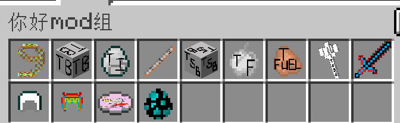

---

- ## ***新增物品组***
  - ###  **你好mod组** 
    * 是的，就是叫这个名字，图标用的是拴绳的(后续应该会换掉)。 \
      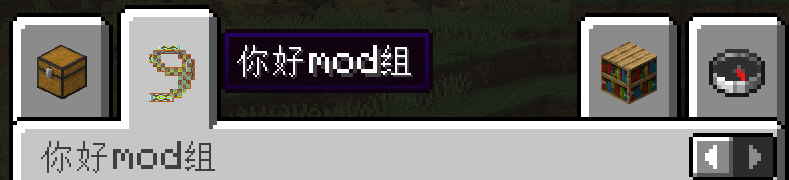

---

- ## ***新增物品***
  - ###  **强劲拴绳**
    * 实际上只是个普通物品，什么能力都没有，也没有拴绳的能力... \
      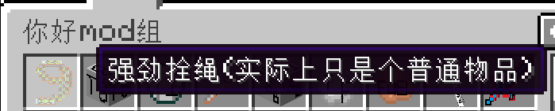
      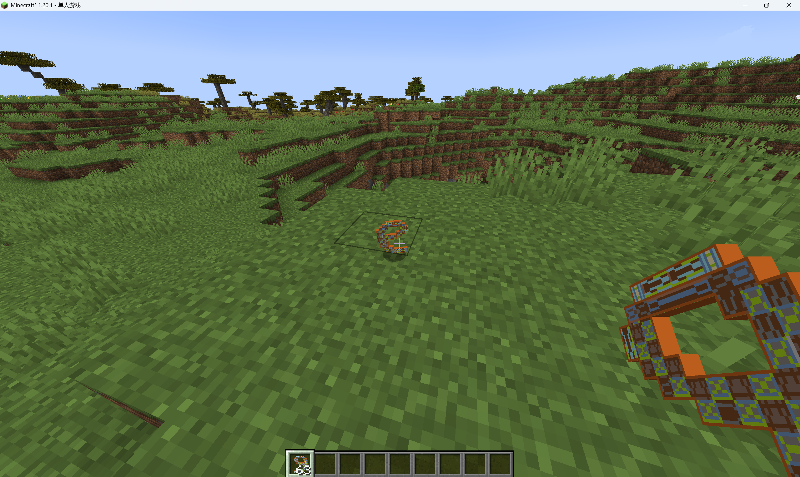

  - ###  **测试物品**
    * 9个测试物品可合成1个测试方块。 \
      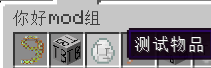
      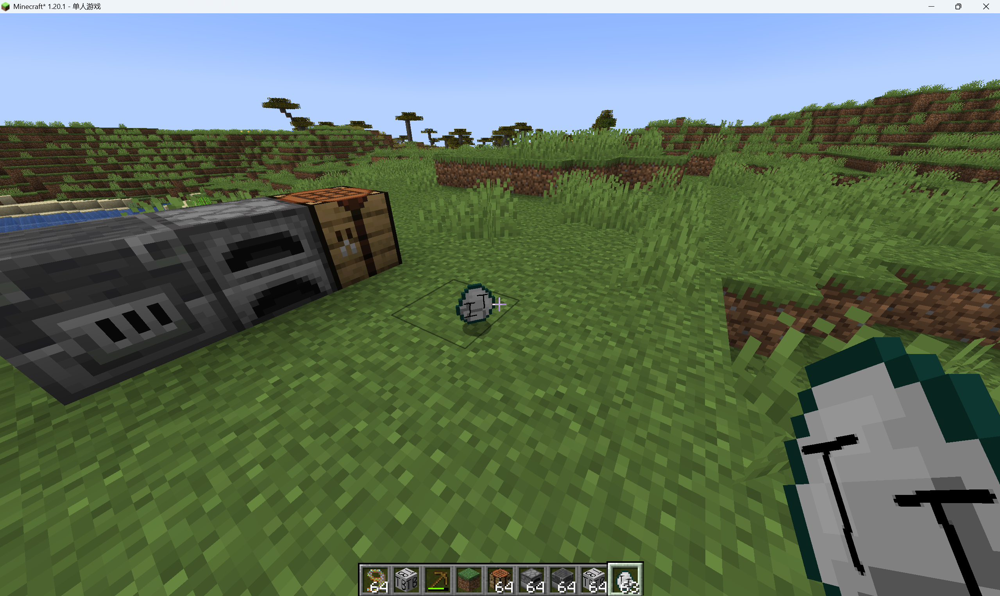

  - ###  **金属探测棒**
    * 右键地表后，如果发现煤或铁矿，会发出"冰冰冰"的声音；
    * 耐久度为1000。 \
      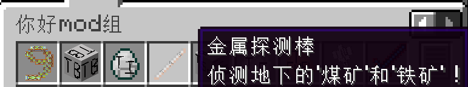
    * 演示视频：

      https://github.com/user-attachments/assets/aab72fa2-80ad-49a8-9ad6-c54b63522db1

  - ###  **测试食物**
    * 食用后回复1格饱食度和0.5格饱和度；
    * 有50%概率触发"幸运"效果。 \
      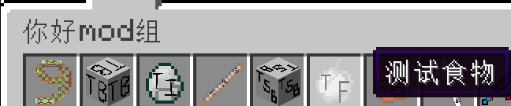

  - ###  **测试燃料**
    * 可燃烧5秒。 \
      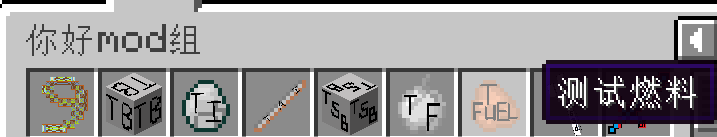

  - ###  **测试3D物品**
    * 3D型物品，并伴随颜色变化；
    * 主副手手持形态不同 \
      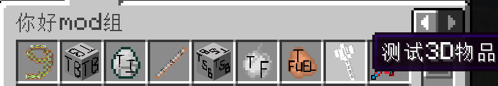
    * 演示视频：

      https://github.com/user-attachments/assets/6469bb80-8091-449f-9515-d5a8ecd5e98f

  - ###  **测试剑**
    * 20点攻击伤害、2.1倍攻击速度；
    * 可由2个"测试物品"+1个"木棍"合成。 \
      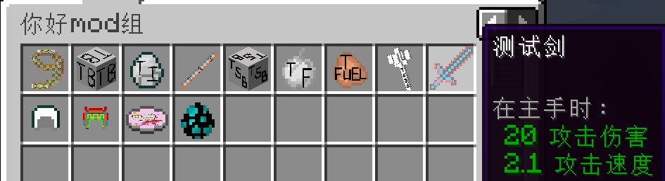
      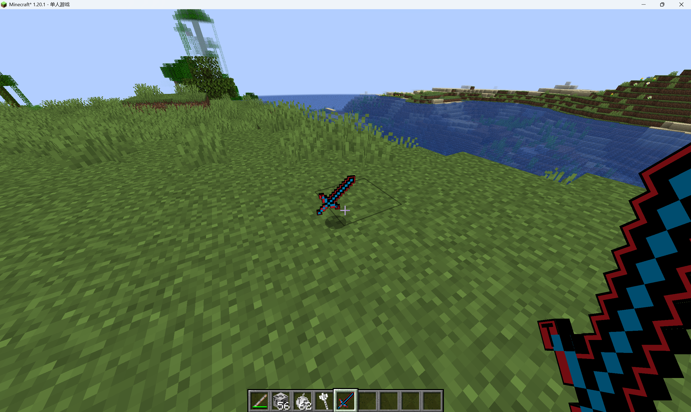

  - ###  **测试头盔**
    * 100点护甲值、100点盔甲韧性、100点击退抗性；
    * 戴上后会无限期触发"迅捷四"、"抗性提升"、"发光"、"夜视"、"生命恢复"效果；
    * 可由5个测试物品合成 合成形状似原版头盔。 \
      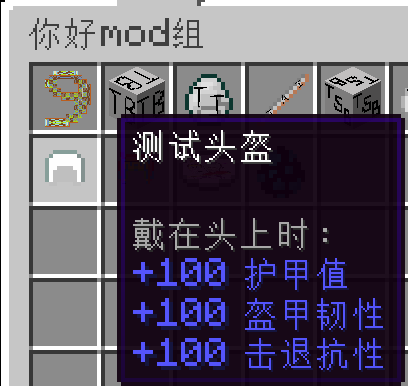 \
      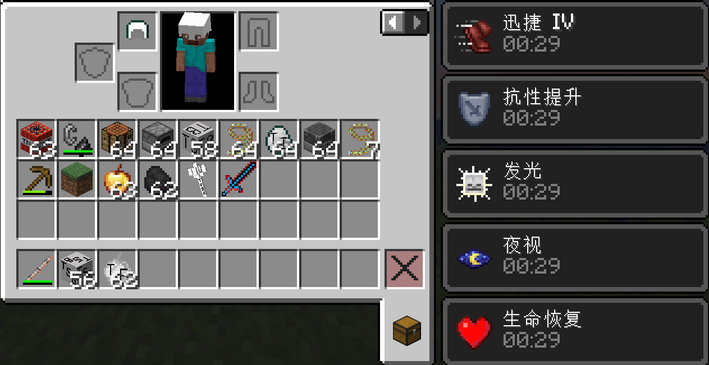

  - ###  **测试3D头盔**
    * 属性和药水效果和"测试头盔"一致；
    * 特别的，此头盔有3种动画：1.行走时触发"头盔缓慢旋转"动画、2.疾跑时触发"头盔快速旋转"动画、3.潜行时触发"头盔旋转起飞又落下"动画；
    * 合成方式为在"测试头盔"的配方基础上 合成表中心加1颗钻石。 \
      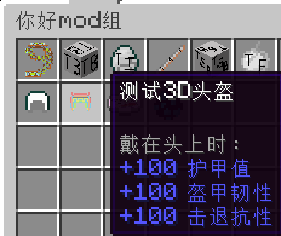
    * 演示视频：

      https://github.com/user-attachments/assets/2c6cdc0e-2016-4002-b3bf-79fd631c1f09

  - ###  **唱片:《娃娃脸》**
    * 放进唱片机后会播放歌曲《娃娃脸》，歌手是后弦；音量随距离远近会有衰减 \
      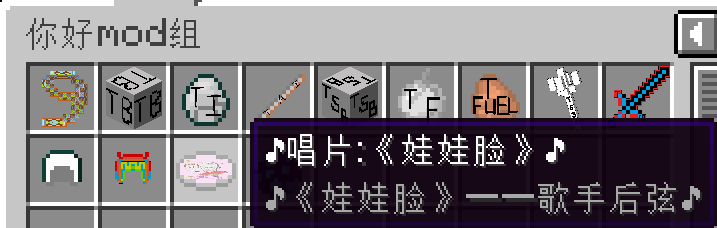
    * 演示视频：

      https://github.com/user-attachments/assets/235f1dac-21b3-493a-8c59-77efe52a9da2

---

- ## ***新增方块***
  - ###  **测试方块**
    * 需用镐子挖掘 挖掘后掉落1个测试方块；
    * 熔炉和高炉可熔炼 熔炼后得到1个强劲拴绳；
    * 紫水晶方块的声音；
    * 1个测试方块可分解为9个测试物品。 \
      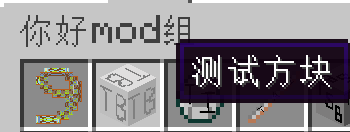
    * 演示视频：

      https://github.com/user-attachments/assets/dfb84fa3-69c6-4604-bb6b-7097f776ce5d

  - ###  **声音方块**
    * 徒手即可挖掘 挖掘后掉落1个测试声音方块；
    * 共有6种声音：1.左键发出"答对题音效"、2.右键发出"木琴音效"、3.走在上面发出"拨浪鼓音效"、4.放置发出"苹果支付成功音效"、5.挖掉发出"泡泡破裂音效"、6.摔落到上面发出"砰音效"。 \
      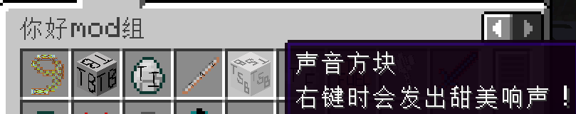
    * 演示视频：

      https://github.com/user-attachments/assets/631e5fcf-3041-490b-9a1e-eb45ff0bfd9c

---

- ## ***新增生物***
  - ###  **Ori**
    * Ori有四种声音：1.环境音、2.受伤音、3.死亡音、4.跳舞音；
    * Ori还有四种动画：1.静止时尾巴、耳朵、手臂会摆动、2.行走、3.坐(空手右键可触发)、4.跳舞(shift+空手右键可触发)；
    * Ori受"测试物品"吸引并繁育。  \
      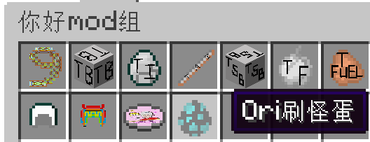
    * 演示视频：
    
      https://github.com/user-attachments/assets/1906bc3c-eb6d-42b7-aec8-563f810f5e52

---

- ## ***修改原版战利品掉落***
  - ###  **击杀村民后会掉落"测试3D头盔"**
    * 如题，击杀村民后会掉落"测试3D头盔"
    * 演示视频：

      https://github.com/user-attachments/assets/14410336-fd09-4ac0-975d-064895c17686

